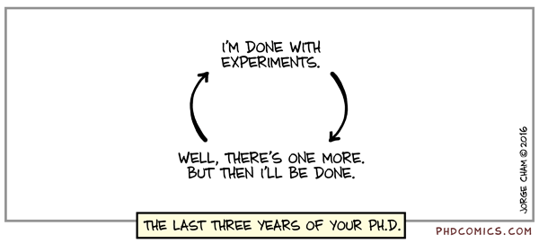

# Escher (`escher-cli`), a command line utility that runs your script with arguments load from a Yaml file

🔥 💥**Now `Escher` supports launching workers on AWS!** 🌟 ✨ ⚡️

## Where Am I? (for the developer himself)

1. [ ] **Need to add `escher init`** so that you have a standard way to setup the scripts for a project.

**For Usage, jump to the next section already :)**

## Motivations

When publishing deep-learning models, there are a lot of boilerplate scripts for the training and inference. When there are twenty-plus models in your work folder it gets increasingly difficult to maintain copies of run scripts that has tight bindings with the particular server you were using.

It makes sense to use a single deep-learning `cli` to minimalize these copy-and-pasted scripts 

When you work on a lot of deep-learning project, some of them playing with other people's code, some of then developing new ones, it really makes sense to standard the structure of project and reduce boiler plate. Here with `escher-cli`, we learn from the best packaging tools on this planet, Ruby `gem`, Javascript `npm`, and rust `crate`. We are particularly inspired by `create-react-app` and the good work that you-know-who has offered the `reactjs` community, and some of the lessons people have learned over-the-years from tools like `gulp`, `bower`, `webpack` and numerous others.

You can think of `escher-cli` as the `create-react-app` for deep-learning. The reason why you want use this is because it offers a boilerplate-free way to **setup new project**, **launch and manage aws, azure, google compute engine servers**, **local and remote training**. Instead of writing `Makefiles` that you have to copy paste in every project, you install `escher-cli` globally *or* in your particular project virtual-env.

In summary, our (**what**) contributions (**you**) are (**get**):

1. A community-driven standard in deep-ML training, development and (later) serving.
2. cross-platform `cli` tools that reduces the cognitive load of running training locally and globally
3. No copy-and-paste scripts in each project.

### IDE Support

We will build a cli tool first. If this catches on, I'm sure JetBrains will add integration in PyCharm:) And if you are not using PyCharm, you should :-P

## Install and Usage

**PyPI Page**: [https://pypi.python.org/pypi/escher-cli](https://pypi.python.org/pypi/escher-cli)

## Todo and Milestones

- [ ] run locally
- [ ] build a worker daemon that `start`, `halt`, `resume`, `reran` jobs
    - [x] finish graphQL schema
- [ ] build a master controller that
    - [ ] does worker discovery (worker report on startup)
    - [ ] maintains a list of jobs
        - [ ] new
        - [ ] running
        - [ ] ran
    - [ ] finish graphQL schema

### Done

- [x] define job file and schema (.escher.run)

### Run Locally

```bash
✓ pip install escher-cli
✗ escher init  # this one creates the `.escher` 
✓ escher run  # runs a default script
# outputs >> `escher run` <default> script works!
✓ escher run scripts/load_electron.escher  # escher script that "looks like" this.
```

### To run experiments on Remote Workers

- [ ] add remote worker support

```bash
✓ pip install escher-cli
✗ escher init --aws-example
escherd  # this starts the local daemon
    ✗ escher master
    ✗ escher worker
# now sit back and enjoy the show
esher run --worker=gpu-worker scripts/load_electrons.escher
```

Configuration for the `gpu-worker` sits inside the `.escher` file. It specifies the `aws` image id, security group etc.

## Overview

`Escher` is a command line utility for your experiments. It manages concurrent runs, command line arguments and other stuff nicely for you!

The things it manages include:

- generating run-specific variables, like `{time}` and `{cwd}` that you can access as template keys in your string.
- maximum numbers of concurrent runs (via python `multiprocess.Pool`)
- environment variables (env) such as `DISPLAY=:1`. You can also passing a file
- **default arguments**
- **batch arguments** for multiple experiments
- **pre-launch** scripts that is ran only once for each batch
- **at-launch** script that is run at the launch time of each experiment
- **post-launch** script that is as soon as each experiment launches
- **post-run** scripts that happens after each experiment is done.

`Escher` works with all of your current work flow and it doesn't lock you into a specific way of doing things. You still get to use bash scripts or Makefile's.

## Why do we use YAML (with JSON planned as well)? My bash script is just fine!

Because YAML(and json) are human **and** machine readable whereas bash arguments are **not**. When is the last time you looked at a bash script looking for hyper-parameters, only to realized that some key parameters are missing? With `Escher` you won't have this problem. You can save all of the past and current runs as nicely readable YAML files(or json, Hjson Cson if you speak coffee script, whatever).

- if you are writing a report, you can include these YAML/json/cson files directly into markdown or latex.
- To see what you ran last night, you can `glob` all of the configurations with `runs/**/experiment.yml` and make nice tables in an instant.
- To run a full batch of experiments, you can type `default_args` just ones, and then only repeat the fields that is different between each run.

Most importantly, `Escher` wants to establish a standard command line tool for machine learning work, and having a standard `run.config.yml` is just the first step!

## Why is `Escher` named "Escher"?

It used to be called `Dave`, after my adviser. I thought it would be funny to `dave --config-file "load_electrons.yml"`. Now it is named to `Escher` (as for the module), and `escher-cli` as the package name.

There already exists a package called `escher` which is why this package is `escher-cli`. However I like the `-cli` postfix b/c it is more clear.

## How shall I use `Escher`?

First thing first, you could `alias` `Escher` with whoever you want to call to run your experiments 😀.

After aliasing this after your favorite person, you can follow the examples bellow :)

Note that [**batteries are included**](https://www.facebook.com/episodeyang/videos/10101189402110434/), and your mileage will vary.

## Example Usage

<a href="./figures/lab_these_are_the_best_days.jpg" target="_blank">

</a>

First install via `pip` (it's that simple!!)

```bash
pip install dave
```

Suppose you have the following folder structure

```
├── your_thesis
└── MAML_tensorflow
    ├── README.md
    ├── experiment.yml
    ├── maml.py
    └── models
        ├── __init__.py
        └── mlp.py
```

where the experiment.yml file looks like this:

```yaml
%YAML 1.2
---
config:
  max_concurrent: 10
env:
  PYTHONPATH: test_directory
run: |
  {env} python maml_bradly.py {args}
default_args:
  npts: 100
  num_epochs: 70000
  num_tasks: 10
  num_grad_steps: 1
  num_points_sampled: 10
  fix_amp: False
batch_args: # use good typing convention here
  - num_tasks: 10
    num_grad_steps: 1
    num_points_sampled: 10
  - num_tasks: 10
    num_grad_steps: 4
    num_points_sampled: 20
tmp:
  - last_run: 10
```

Now under the project root, you can just run

```bash
dave --config-file "escher.py"
```

and it will automatically run the experiment twice, using the arguments in the `batch_args` field of the Yaml configuration file.
## To Develop

first download from github. Then under project folder, run (you also need to install the packages).

```bash
make dev test
```

### Bucket List

- [ ] Allow extensions
- [ ] work on windows
- [ ] allow env files
- [ ] daemon mode

## Happy Doing Science!



